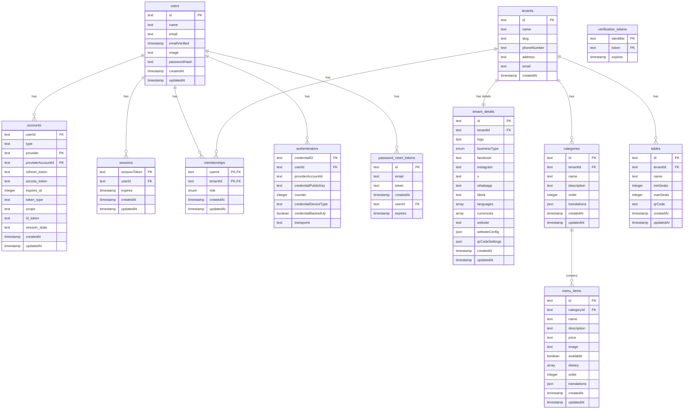

# Database Schema Diagram

```mermaid
erDiagram
    users ||--o{ accounts : "has"
    users ||--o{ sessions : "has"
    users ||--o{ memberships : "has"
    users ||--o{ authenticators : "has"
    users ||--o{ password_reset_tokens : "has"

    tenants ||--o{ memberships : "has"
    tenants ||--|| tenant_details : "has details"
    tenants ||--o{ categories : "has"
    tenants ||--o{ tables : "has"

    categories ||--o{ menu_items : "contains"

    users {
        text id PK
        text name
        text email
        timestamp emailVerified
        text image
        text passwordHash
        timestamp createdAt
        timestamp updatedAt
    }

    accounts {
        text userId FK
        text type
        text provider PK
        text providerAccountId PK
        text refresh_token
        text access_token
        integer expires_at
        text token_type
        text scope
        text id_token
        text session_state
        timestamp createdAt
        timestamp updatedAt
    }

    sessions {
        text sessionToken PK
        text userId FK
        timestamp expires
        timestamp createdAt
        timestamp updatedAt
    }

    verification_tokens {
        text identifier PK
        text token PK
        timestamp expires
    }

    password_reset_tokens {
        text id PK
        text email
        text token
        timestamp createdAt
        text userId FK
        timestamp expires
    }

    authenticators {
        text credentialID PK
        text userId FK
        text providerAccountId
        text credentialPublicKey
        integer counter
        text credentialDeviceType
        boolean credentialBackedUp
        text transports
    }

    tenants {
        text id PK
        text name
        text slug
        text phoneNumber
        text address
        text email
        timestamp createdAt
    }

    tenant_details {
        text id PK
        text tenantId FK
        text logo
        enum businessType
        text facebook
        text instagram
        text x
        text whatsapp
        text tiktok
        array languages
        array currencies
        text website
        json websiteConfig
        json qrCodeSettings
        timestamp createdAt
        timestamp updatedAt
    }

    memberships {
        text userId PK, FK
        text tenantId PK, FK
        enum role
        timestamp createdAt
        timestamp updatedAt
    }

    categories {
        text id PK
        text tenantId FK
        text name
        text description
        integer order
        json translations
        timestamp createdAt
        timestamp updatedAt
    }

    menu_items {
        text id PK
        text categoryId FK
        text name
        text description
        text price
        text image
        boolean available
        array dietary
        integer order
        json translations
        timestamp createdAt
        timestamp updatedAt
    }

    tables {
        text id PK
        text tenantId FK
        text name
        integer minSeats
        integer maxSeats
        text qrCode
        timestamp createdAt
        timestamp updatedAt
    }
```
