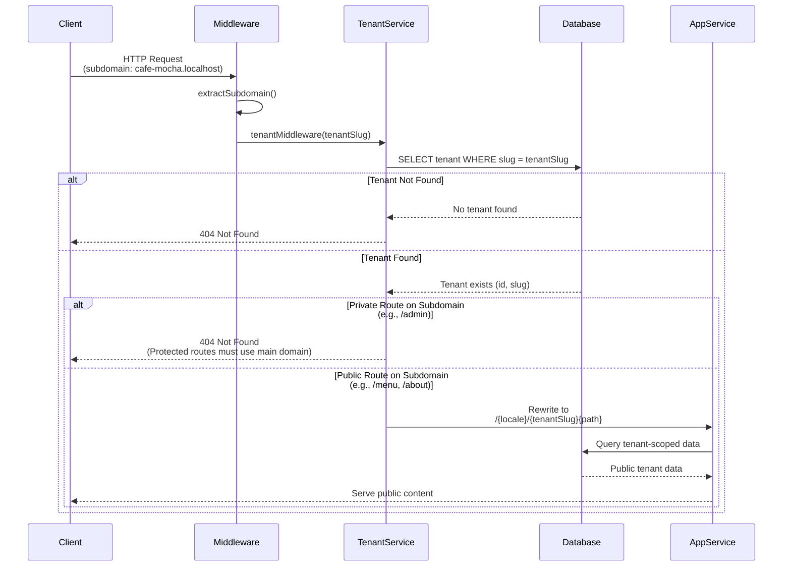
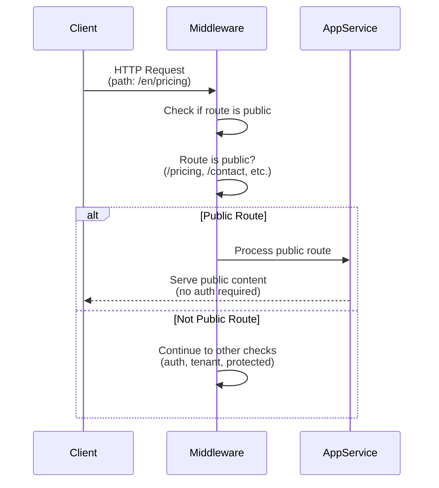
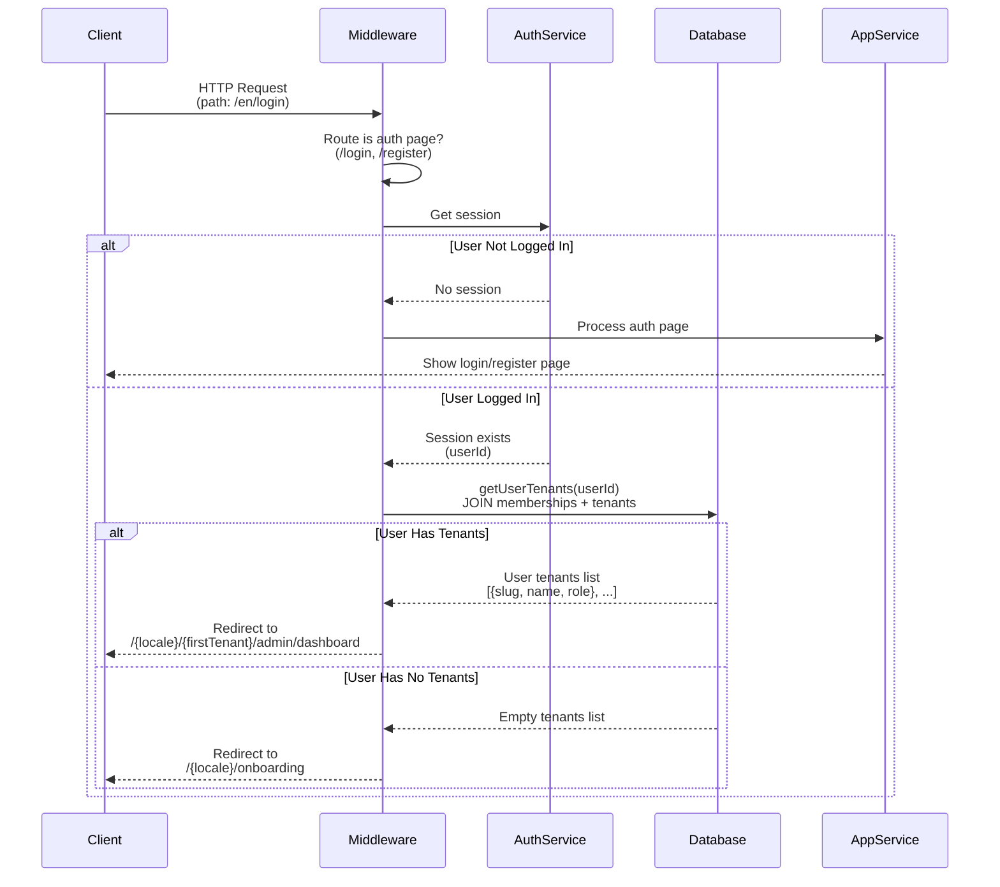
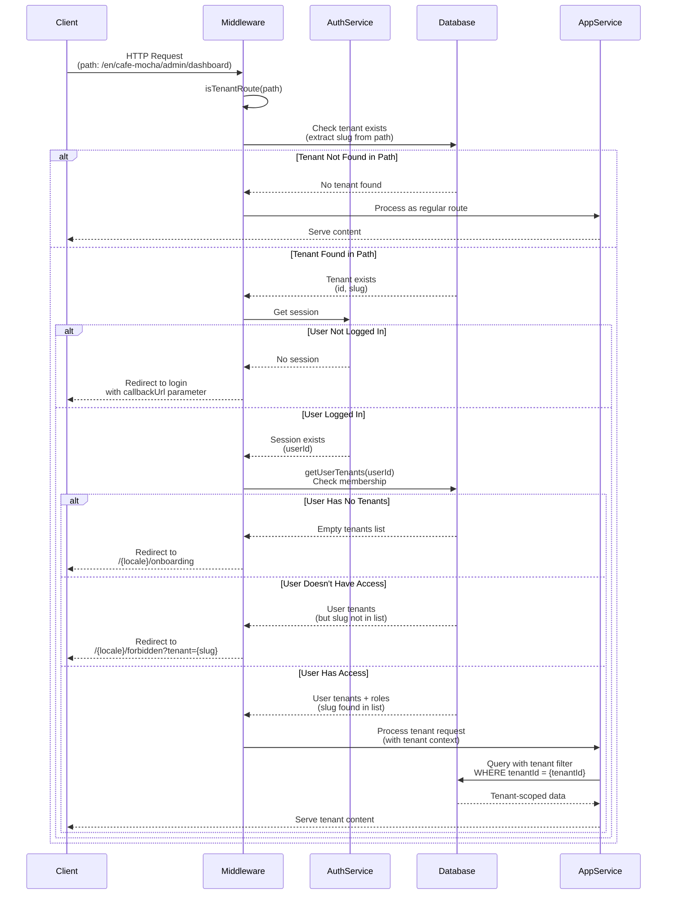
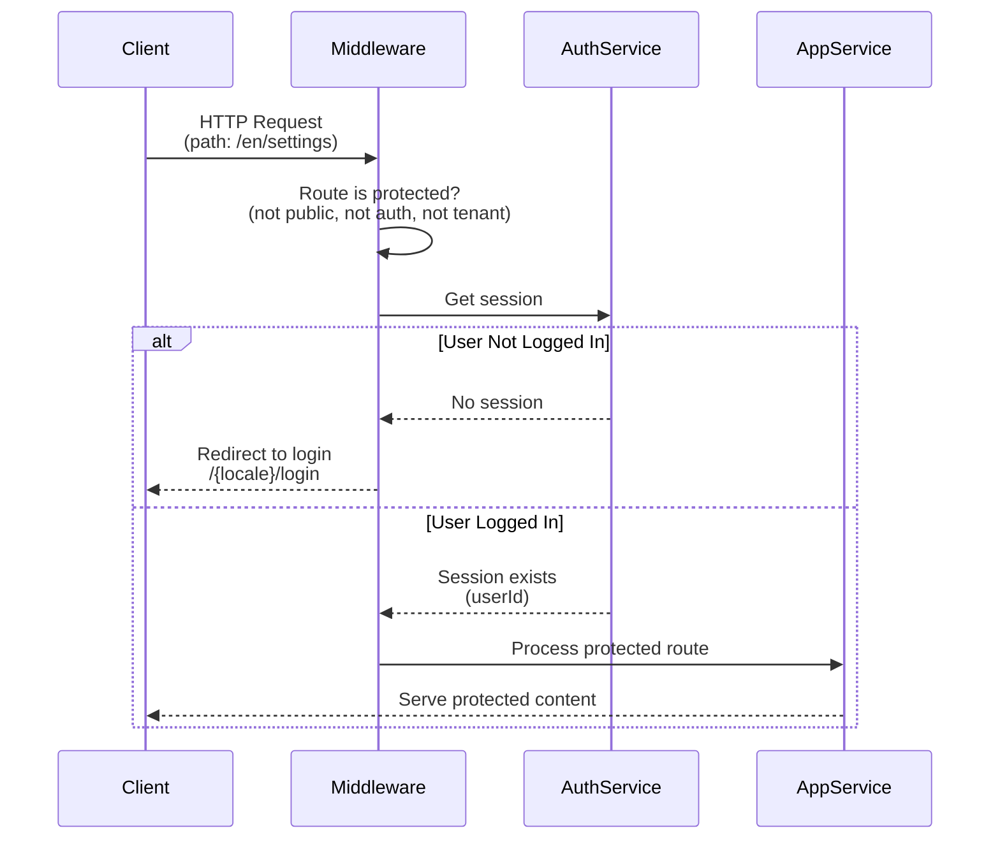

# Multi-Tenant Request Flow

This document contains sequence diagrams for different request flow scenarios in the multi-tenant application.

## 1. Subdomain-Based Request Flow

This flow handles requests coming from tenant subdomains (e.g., `cafe-mocha.localhost` or `cafe-mocha.example.com`).

**Key Points:**
- Subdomain is extracted from the host header
- Tenant validation happens before route processing
- Private routes (like `/admin`) are blocked on subdomains for security
- Public routes are rewritten to include tenant context

---

## 2. Public Route Handling

Public routes are accessible without authentication (e.g., `/`, `/pricing`, `/contact`).

**Key Points:**
- No authentication required
- No tenant context needed
- Immediate response without database queries

---

## 3. Auth Page Handling

This flow handles authentication pages like `/login` and `/register`.

**Key Points:**
- If user is already logged in, redirect based on tenant membership
- New users without tenants are sent to onboarding
- Existing users with tenants go to their first tenant's dashboard

---

## 4. Tenant Route Handling (Path-Based)

This flow handles tenant-specific routes accessed via main domain (e.g., `/en/cafe-mocha/admin/dashboard`).

**Key Points:**
- Tenant slug is extracted from URL path (second segment after locale)
- Tenant existence is validated before access control
- User membership is checked via `memberships` table
- All database queries are filtered by tenant ID for data isolation
- Access denied users see a forbidden page with tenant information

---

## 5. Protected Route Handling

This flow handles general protected routes that require authentication but are not tenant-specific.

**Key Points:**
- Simple authentication check
- No tenant context required
- Redirects to login if not authenticated

---

## Flow Summary

### Request Routing Decision Tree

1. **Subdomain Present?**
   - Yes → Subdomain-Based Request Flow
   - No → Continue to route classification

2. **Route Type?**
   - Public → Public Route Handling
   - Auth Page → Auth Page Handling
   - Tenant Route → Tenant Route Handling
   - Protected → Protected Route Handling

### Key Components

- **Tenant Identification**: Via subdomain (`cafe-mocha.localhost`) or URL path (`/en/cafe-mocha/...`)
- **Access Control**: Validated through `memberships` table (user-tenant-role relationship)
- **Session Management**: NextAuth sessions stored in `sessions` table
- **Data Isolation**: All tenant queries filtered by tenant ID for multi-tenancy
- **Security**: Private routes blocked on subdomains, must use main domain

