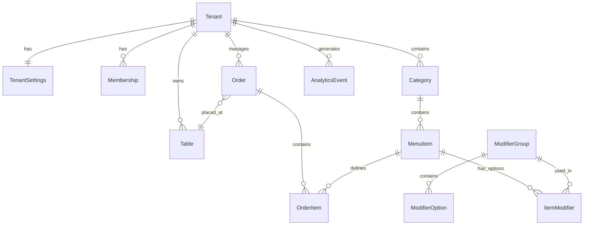

# Database Schema Recommendation

This document outlines a recommended database schema designed "from scratch" to support a scalable multi-tenant menu system, including provisions for **Table Ordering**, **Analytics**, and future scalability (Inventory, Modifiers, Payments).

## Design Philosophy

- **Multi-tenancy at Roots**: Every core entity is linked to `tenantId` for security and easier data partitioning (Row Level Security).
- **JSON for Flexibility, Tables for Rigidity**: Use JSONB for configuration (branding, dynamic attributes) but strict relational tables for transactional data (orders, inventory).
- **Performance Optimization**: Indexes on frequently queried fields (`tenantId`, `slug`, `createdAt`).
- **Analytics Separation**: Operational data (orders) is kept optimized for writes, while analytics data is structured for aggregation.

---

## 1. Core Domain: Tenants & Identity

The foundation of the application. We separate "Account/Login" from "Profile" to allow for social logins and multiple emails.

```typescript
// tenants
export const tenants = pgTable("tenants", {
	id: text("id").primaryKey(),
	slug: text("slug").unique().notNull(), // for pretty URLs e.g. menu.com/my-cafe
	name: text("name").notNull(),
	isActive: boolean("isActive").default(true),
	// Subscription tier for feature gating
	plan: text("plan").default("FREE"),
	createdAt: timestamp("createdAt").defaultNow(),
});

// tenant_settings (1:1 with tenants)
// Separated to keep the 'tenants' table lightweight
export const tenantSettings = pgTable("tenant_settings", {
	tenantId: text("tenantId")
		.primaryKey()
		.references(() => tenants.id),
	branding: json("branding"), // colors, logo, fonts
	socials: json("socials"), // facebook, instagram links
	features: json("features"), // toggle features like "ordering", "reviews"
	currency: text("currency").default("USD"),
	// Locales: default is the primary language, supported are translations
	locales: json("locales")
		.$type<{ default: string; supported: string[] }>()
		.default({ default: "en", supported: [] }),
	timezone: text("timezone").default("UTC"),
});

// memberships (User <-> Tenant)
export const memberships = pgTable(
	"memberships",
	{
		userId: text("userId").references(() => users.id),
		tenantId: text("tenantId").references(() => tenants.id),
		role: text("role").notNull(), // OWNER, MANAGER, WAITER
	},
	(t) => ({
		pk: primaryKey(t.userId, t.tenantId),
	}),
);
```

## 2. Menu Domain (Enhanced)

The current schema is flat (`menuItems` -> `categories`). For a robust ordering system, we need **Modifiers** (e.g., "Steak Temp", "Add Cheese").

```typescript
// categories
export const categories = pgTable("categories", {
	id: text("id").primaryKey(),
	tenantId: text("tenantId").notNull(),
	name: text("name").notNull(),
	order: integer("order").default(0),
	isActive: boolean("isActive").default(true),
	availability: json("availability"), // { start: "10:00", end: "22:00", days: [1,2,3,4,5] }
});

// menu_items
export const menuItems = pgTable("menu_items", {
	id: text("id").primaryKey(),
	tenantId: text("tenantId").notNull(),
	categoryId: text("categoryId").references(() => categories.id),
	name: text("name").notNull(),
	description: text("description"),
	price: decimal("price", { precision: 10, scale: 2 }).notNull(),
	image: text("image"),
	isSoldOut: boolean("isSoldOut").default(false),
	// Availability at item level (overrides category if set)
	availability: json("availability"), // { start: "10:00", end: "22:00", days: [1,2,3,4,5] }
});

// modifier_groups (New: "Pizza Toppings", "Steak Temperature")
export const modifierGroups = pgTable("modifier_groups", {
	id: text("id").primaryKey(),
	tenantId: text("tenantId").notNull(),
	name: text("name").notNull(), // e.g. "Choice of Side"
	minSelection: integer("minSelection").default(0), // 1 = required
	maxSelection: integer("maxSelection"), // null = unlimited
});

// modifier_options (New: "Mushrooms", "Medium Rare")
export const modifierOptions = pgTable("modifier_options", {
	id: text("id").primaryKey(),
	groupId: text("groupId").references(() => modifierGroups.id),
	name: text("name").notNull(),
	priceAdjustment: decimal("priceAdjustment", {
		precision: 10,
		scale: 2,
	}).default("0"),
});

// item_modifiers (Join table: Which items have which modifiers)
export const itemModifiers = pgTable(
	"item_modifiers",
	{
		itemId: text("itemId").references(() => menuItems.id),
		groupId: text("groupId").references(() => modifierGroups.id),
		order: integer("order"),
	},
	(t) => ({
		pk: primaryKey(t.itemId, t.groupId),
	}),
);
```

## 3. Order Management Domain (New)

This is the core of the "Table Ordering" feature.

```typescript
export const orderStatusEnum = pgEnum("order_status", [
	"PENDING",
	"CONFIRMED",
	"PREPARING",
	"READY",
	"SERVED",
	"COMPLETED",
	"CANCELLED",
]);

export const orderTypeEnum = pgEnum("order_type", [
	"DINE_IN",
	"TAKEOUT",
	"DELIVERY",
]);

// orders
export const orders = pgTable("orders", {
	id: text("id").primaryKey(),
	tenantId: text("tenantId").notNull(),
	tableId: text("tableId").references(() => tables.id), // Nullable for takeout

	status: orderStatusEnum("status").default("PENDING"),
	type: orderTypeEnum("type").default("DINE_IN"),

	totalAmount: decimal("totalAmount", { precision: 10, scale: 2 }).notNull(),

	customerName: text("customerName"), // Optional for quick ordering
	customerPhone: text("customerPhone"),

	paymentStatus: text("paymentStatus").default("UNPAID"), // UNPAID, PAID, REFUNDED

	createdAt: timestamp("createdAt").defaultNow(),
	updatedAt: timestamp("updatedAt").defaultNow(),
});

// order_items
export const orderItems = pgTable("order_items", {
	id: text("id").primaryKey(),
	orderId: text("orderId").references(() => orders.id),
	menuItemId: text("menuItemId").references(() => menuItems.id),

	quantity: integer("quantity").notNull(),
	unitPrice: decimal("unitPrice").notNull(), // Snapshot price at time of order is critical!

	notes: text("notes"), // "No onions please"

	// selectedModifiers would be stored as JSON for simplicity in querying history,
	// or strictly normalized via another table `order_item_modifiers` if structured analysis is needed.
	// Recommended: JSON for speed/readability, unless you need to analyze "how many pepperoni vs cheese" deeply.
	modifiers: json("modifiers"),
});
```

## 4. Analytics Domain (New)

For "Analytics", we need to track user behavior _before_ they order.

```typescript
// analytics_events
// High volume table. Consider partitioning by month if using Postgres directly,
// or offloading to ClickHouse/Tinybird in the future.
export const analyticsEvents = pgTable("analytics_events", {
	id: text("id").primaryKey(),
	tenantId: text("tenantId").notNull(),
	sessionId: text("sessionId").notNull(), // Anonymous browser session

	eventType: text("eventType").notNull(), // VIEW_MENU, VIEW_ITEM, ADD_TO_CART, SCAN_QR

	metadata: json("metadata"), // { itemId: "...", categoryId: "...", source: "qr_code" }

	createdAt: timestamp("createdAt").defaultNow(),
});

// daily_stats (Aggregated table for dashboard performance)
// Populated via cron job or trigger
export const dailyStats = pgTable("daily_stats", {
	tenantId: text("tenantId").notNull(),
	date: date("date").notNull(),

	totalViews: integer("totalViews").default(0),
	totalOrders: integer("totalOrders").default(0),
	totalRevenue: decimal("totalRevenue").default("0"),

	pk: primaryKey(t.tenantId, t.date),
});
```

## 5. Operations Domain

Enhancing the "Tables" concept.

```typescript
export const tables = pgTable("tables", {
	id: text("id").primaryKey(),
	tenantId: text("tenantId").notNull(),
	name: text("name").notNull(), // "Table 1", "Bar 3"
	zone: text("zone"), // "Patio", "Main Hall"
	capacity: integer("capacity"),
	qrCodeToken: text("qrCodeToken").unique(), // Secure token for the QR URL
});
```

## Visual Overview



## Key Improvements over Current Schema

1.  **Strict Typing for Money**: Changed `price` from `text` to `decimal` (or `integer` cents) to prevent math errors.
2.  **Order Architecture**: Added full `Orders` -> `OrderItems` flow which was missing.
3.  **Modifiers System**: Added `ModifierGroups` and `Options` to support complex menu configuration, essential for a real "Crafter" experience.
4.  **Snapshotting**: Explicitly noted that `OrderItems` should store the _price at time of purchase_, not just strict reference to `MenuItem`, to handle price changes over time.
5.  **Analytics Foundation**: Added granular event tracking clearly separated from transactional data.
