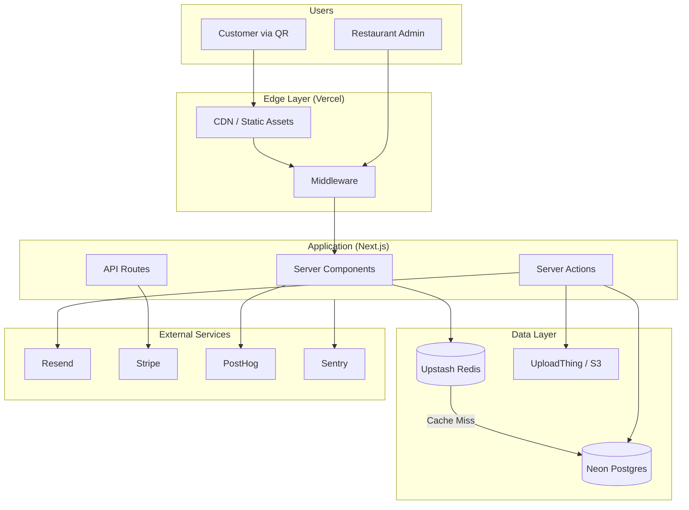

# Infrastructure Architecture Recommendations

> **Document Purpose**: This document analyzes the current implementation of Menu Crafter and provides recommendations for scaling to **1000s of concurrent users/tenants** based on industry best practices and the actual codebase.

---

## 1. Current Technology Stack Analysis

Based on code review of the implementation:

| Layer               | Current Implementation        | Status       |
| ------------------- | ----------------------------- | ------------ |
| **Framework**       | Next.js 15 (App Router)       | ✅ Excellent |
| **Database**        | Neon Postgres (Serverless)    | ✅ Excellent |
| **ORM**             | Drizzle ORM                   | ✅ Excellent |
| **Auth**            | NextAuth.js v5 (JWT strategy) | ✅ Good      |
| **Styling**         | Tailwind CSS v4               | ✅ Excellent |
| **i18n**            | next-intl                     | ✅ Good      |
| **Deployment**      | Vercel                        | ✅ Excellent |
| **Image Storage**   | Text URL field only           | ⚠️ Gap       |
| **Caching**         | None implemented              | ⚠️ Gap       |
| **Rate Limiting**   | None implemented              | ⚠️ Gap       |
| **Background Jobs** | None implemented              | ⚠️ Gap       |
| **Analytics**       | Not implemented               | ⚠️ Gap       |
| **Payments**        | Not implemented               | ⚠️ Gap       |

---

## 2. Architecture Strengths (Keep As-Is)

### 2.1 Multi-Tenant Routing

The middleware implementation (`src/middlewares/tenant.ts` and `src/middlewares/app.ts`) is well-designed:

- **Subdomain extraction** for tenant identification
- **Public/Private route separation** for tenant websites
- **Session-based tenant access validation**
- **Proper redirect flows** (login → dashboard or onboarding)

### 2.2 Database Schema

The Drizzle schema (`src/lib/db/schema/`) follows best practices:

- **`tenantId` foreign keys** on all tenant-scoped tables (categories, menuItems, tables)
- **Proper cascading deletes** for data integrity
- **JSON columns** for flexible configs (websiteConfig, qrCodeSettings, translations)
- **Type inference** with `$inferSelect` and `$inferInsert`

### 2.3 Auth Configuration

NextAuth v5 with JWT strategy is ideal for serverless:

- **Stateless sessions** (no DB hit per request)
- **Google OAuth + Credentials** providers
- **DrizzleAdapter** for user persistence

---

## 3. Infrastructure Gaps & Recommendations

### 3.1 Image/Asset Storage (Critical)

**Current State**: `image: text("image")` stores URLs but no upload solution.

**Problem at Scale**: Restaurants need to upload food images. Without a proper solution:

- Users might hotlink external images (unreliable)
- No image optimization = slow load times on mobile

**Recommendation**: **UploadThing** (or Cloudinary/AWS S3 + CloudFront)

| Service                 | Pros                                              | Cons              |
| ----------------------- | ------------------------------------------------- | ----------------- |
| **UploadThing**         | Built for Next.js, easy integration, includes CDN | Newer service     |
| **Cloudinary**          | Mature, excellent transforms                      | Can get expensive |
| **AWS S3 + CloudFront** | Industry standard, cheapest at scale              | More setup        |

**Implementation Priority**: 🔴 **Critical** - Required before beta launch

---

### 3.2 Caching Layer (Critical for Scale)

**Current State**: Every request hits Neon Postgres directly.

**Problem at Scale**:

- Public menu pages (scanned via QR) will spike during lunch/dinner
- Each QR scan = DB query for tenant + categories + menu items
- Neon handles connections well, but latency adds up globally

**Recommendation**: **Upstash Redis** (Serverless Redis)

**Use Cases**:

1. **Menu Cache**: Cache published menu JSON per tenant (`menu:{tenantSlug}`)
2. **Rate Limiting**: Protect public endpoints from bots
3. **Session Cache**: Store frequent auth checks

**Cache Strategy**:

```
┌─────────────────┐      ┌─────────────┐      ┌─────────────┐
│   QR Code Scan  │ ───▶ │   Redis     │ ───▶ │   Postgres  │
│   (Customer)    │      │   Cache     │      │   (if miss) │
└─────────────────┘      └─────────────┘      └─────────────┘
                               │
                    TTL: 5 min or revalidate
                    on admin menu update
```

**Implementation Priority**: 🔴 **Critical**

---

### 3.3 Rate Limiting (Security)

**Current State**: No rate limiting on public or API routes.

**Risk**:

- Bots scraping menu data
- DDoS on public QR pages
- Brute force on login

**Recommendation**: Implement rate limiting using **Upstash Ratelimit**

```
Limits:
- Public menu pages: 60 requests/minute/IP
- Login attempts: 5 requests/15 minutes/IP
- API mutations: 30 requests/minute/user
```

**Implementation Priority**: 🟡 **High**

---

### 3.4 Background Job Processing

**Current State**: All operations are synchronous (e.g., email sending via nodemailer).

**Problem**:

- Bulk menu imports would timeout
- Email sending blocks the response
- Image processing at upload would timeout

**Recommendation**: **Upstash QStash** (serverless job queue)

**Use Cases**:

1. Email sending (welcome, password reset)
2. Bulk menu import processing
3. Analytics aggregation
4. Scheduled tasks (e.g., daily reports)

**Implementation Priority**: 🟢 **Medium**

---

### 3.5 Transactional Email

**Current State**: `nodemailer` (basic, self-managed SMTP).

**Problem**:

- Deliverability issues (spam filters)
- No email templates
- No tracking (opens, bounces)

**Recommendation**: **Resend** (with react-email for templates)

**Why Resend**:

- Built by ex-Vercel team
- Native React component templates
- Excellent deliverability
- Free tier: 100 emails/day

**Implementation Priority**: 🟡 **High**

---

### 3.6 Error Tracking & Monitoring

**Current State**: No error tracking.

**Problem**: Production errors go unnoticed until users complain.

**Recommendation**: **Sentry**

**Why Sentry**:

- Automatic error capture (frontend + backend)
- Performance monitoring
- Release tracking
- Free tier: 5K events/month

**Implementation Priority**: 🟡 **High**

---

### 3.7 Analytics & Product Insights

**Current State**: `/admin/analytics` route exists but implementation unclear.

**Recommendation**:

- **PostHog** for product analytics (menu views, item clicks)
- **Vercel Analytics** for web vitals

**Key Events to Track**:

- `menu_viewed` (tenant, source)
- `item_clicked` (item_id, category)
- `qr_scanned` (table_id if applicable)
- `order_placed` (future)

**Implementation Priority**: 🟢 **Medium**

---

### 3.8 Payments & Subscriptions

**Current State**: Not implemented.

**Recommendation**: **Stripe** (Checkout + Customer Portal)

**Schema Addition**:

```sql
-- Add to tenants table
subscription_status: 'free' | 'pro' | 'enterprise'
stripe_customer_id: text
stripe_subscription_id: text
```

**Implementation Priority**: 🟢 **Medium** (Required for monetization)

---

## 4. Recommended Architecture Diagram



---

## 5. Cost Estimate (1000 Tenants Scale)

| Service           | Free Tier        | Estimated Cost   |
| ----------------- | ---------------- | ---------------- |
| **Vercel**        | 100GB bandwidth  | $20/mo (Pro)     |
| **Neon Postgres** | 3GB storage      | $19/mo (Launch)  |
| **Upstash Redis** | 10K commands/day | $0 (Free)        |
| **UploadThing**   | 2GB storage      | $10/mo           |
| **Resend**        | 3K emails/mo     | $0 (Free)        |
| **Sentry**        | 5K events/mo     | $0 (Free)        |
| **PostHog**       | 1M events/mo     | $0 (Free)        |
| **Stripe**        | 2.9% + 30¢       | Per transaction  |
| **Total**         |                  | **~$50/mo base** |

---

## 6. Implementation Roadmap

### Phase 1: Foundation (Week 1-2)

1. ✅ Current: Multi-tenant routing, auth, basic CRUD
2. Add UploadThing for image uploads
3. Add Upstash Redis for caching

### Phase 2: Reliability (Week 3-4)

1. Implement rate limiting middleware
2. Add Sentry error tracking
3. Switch to Resend for emails

### Phase 3: Scale Features (Week 5-6)

1. Add menu caching with revalidation
2. Implement background job queue
3. Add PostHog analytics

### Phase 4: Monetization (Week 7-8)

1. Stripe integration
2. Subscription gating
3. Usage limits by plan

---

## 7. Summary

Your current stack (Next.js 15 + Neon + Drizzle + Vercel) is an **excellent foundation**. The key gaps for scaling to 1000s of users are:

1. **🔴 Image Storage** - UploadThing
2. **🔴 Caching** - Upstash Redis
3. **🟡 Rate Limiting** - Upstash Ratelimit
4. **🟡 Error Tracking** - Sentry
5. **🟡 Email** - Resend
6. **🟢 Analytics** - PostHog
7. **🟢 Payments** - Stripe

All recommended services have generous free tiers, keeping costs minimal until significant scale is reached.
